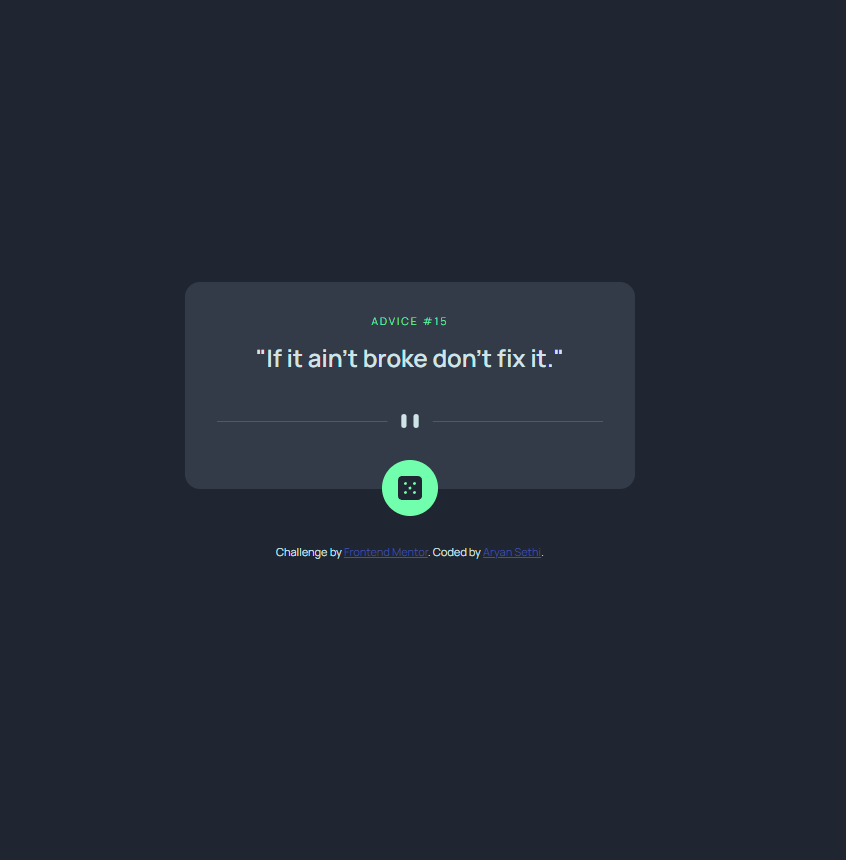

# Frontend Mentor - Advice generator app solution

This is a solution to the [Advice generator app challenge on Frontend Mentor](https://www.frontendmentor.io/challenges/advice-generator-app-QdUG-13db). Frontend Mentor challenges help you improve your coding skills by building realistic projects.

## Table of contents

-   [Overview](#overview)
    -   [The challenge](#the-challenge)
    -   [Screenshot](#screenshot)
    -   [Links](#links)
-   [My process](#my-process)
    -   [Built with](#built-with)
    -   [What I learned](#what-i-learned)
    -   [Continued development](#continued-development)
    -   [Useful resources](#useful-resources)
-   [Author](#author)

## Overview

### The challenge

Users should be able to:

-   View the optimal layout for the app depending on their device's screen size
-   See hover states for all interactive elements on the page
-   Generate a new piece of advice by clicking the dice icon

### Screenshot

### Links

-   Solution URL: [https://github.com/Aryan-ki-codepanti/advice-generator-fm](https://github.com/Aryan-ki-codepanti/advice-generator-fm)
-   Live Site URL: [https://aryan-ki-codepanti.github.io/advice-generator-fm/](https://aryan-ki-codepanti.github.io/advice-generator-fm/)

## My process

### Built with

-   Semantic HTML5 markup
-   CSS custom properties
-   Flexbox

### What I learned

-   box shadows
-   layouting

### Continued development

-   build responsive layouts

### Useful resources

-   MDN
-   GFG

## Author

-   Website - [Aryan Sethi](https://github.com/Aryan-ki-codepanti)
-   Frontend Mentor - [@Aryan Sethi](https://www.frontendmentor.io/profile/Aryan-ki-codepanti)
